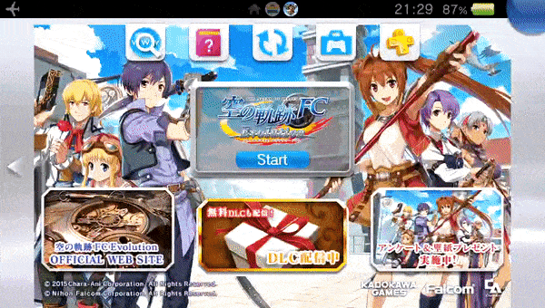

# FAQ to Vita Manual Converter

## Description

This program takes a URL to an online HTML guide and converts it into a format suitable to use as a Vita game's bubble manual. This can be used to replace the manual of any game, be it Vita, PSP, PSX or Homebrew.



This program works by rendering the HTML file into a series of PNG files, naming them as `001.png`, `002.png`, and so on, and maximizing as much screen space as possible.

It is intended to be used with HTML guides, like the ones found in sites like GameFAQs. It can be configured into different modes by giving it input arguments (see [usage](#usage)).

If trying to download a GameFAQs guide, use the URL that opens the guide normally, e.g.:
`https://gamefaqs.gamespot.com/[console]/[game-id]/faqs/[faq-id]`

You will need [rePatch-reLoaded](https://github.com/SonicMastr/rePatch-reLoaded) to replace manuals from Vita games.


## Usage

The script has the following dependencies:
* Python 3
* pdf2image `pip install pdf2image`
* requests `pip install requests`
* BeautifulSoup4 `pip install beautifulsoup4`
* html5lib `pip install html5lib`
* Selenium `pip install selenium`

Alternatively, you can use `pipenv` to setup a virtual environment to download the dependencies and run the script:

Install `pipenv` if not installed:  
`pip install --user pipenv`

Setup the environment with:  
`python -m pipenv install`

Execute script with:  
`python -m pipenv run python main.py [OPTIONS] URL`

Here are the usage instructions:

```
Converts an online guide into PNG files to be used as a Vita manual.

Options:
  --version             show program's version number and exit
  -h, --help            show this help message and exit
  -f, --formatted       Outputs guide with CSS styling. May not look correct.
  -s TEXT_SIZE, --size=TEXT_SIZE
                        Size of text: small, medium or large. Maximum number
                        of pages allowed is 999, any more and the Vita manual
                        option will crash [default: medium]
  -o DIR, --outputdir=DIR
                        Output images to DIR
```

### Examples

Download a guide and output it at `./output`:
`python main.py https://example.com/text`


## Output and Using the Manual on the Vita

PNG files will be output by default to a `output/` directory in the working dir. Vita games have their `app/` directories encrypted, so you will need [rePatch-reLoaded](https://github.com/SonicMastr/rePatch-reLoaded) to replace their manual. To use them on a bubble on the Vita, there's two options:

### Existing Manual
If the app/bubble you want to modify is a Vita game or a PSX/PSP bubble that already has a manual in the Live Area, then you need to place the `manual/` directory in its repatch folder: `ux0:repatch/<app-id>/sce_sys/manual/`. 

### No manual
If the PSP/PSX bubble you want to add the manual to does not have a manual already (no "manual" book icon in the Live Area of the bubble), then you need to use [Adrenaline Bubble Manager (ABM)](https://github.com/ONElua/AdrenalineBubbleManager) to inject one.

- Copy the `manual` directory produced by this script to `ux0:ABM/<any-dir>`. Note that the final directory where the PNG files are must be `ux0:ABM/<any-dir>/manual/*.png` 
- On ABM, press `Circle` to modify bubbles, select your desired bubble and press `Cross` to "Inject imgs". 
- Navigate to `<any-dir>`, and you should see `manual` directory in the screen. 
- Press `Start` to "load all images to the bubble", and wait for the process to finish. 
- After this, you'll now see the "manual" icon in the bubble's Live Area.

Vita games without a manual cannot have a manual added.

## FAQ

* **I don't want to install rePatch, is there a way to use the manuals?**  
  If you don't want to install rePatch, then you can only replace existing manuals on PSX/PSP bubbles that you made. To do this, copy and replace the PNG files in the app/bubble's directory, e.g. `ux0:app/<app-id>/sce_sys/manual`.  
  This directory should already exist (every bubble with a working manual has it), and make sure to remove all files on this directory first. This is not recommended and the rePatch solution is preferable.  
  Note: this will not work on Vita games, as their `app/` directory is encrypted and you cannot replace the manual (even if you did, it won't work).

* **When opening the manual, my Vita says that the file is corrupted!**  
  This could be due to a variety of reasons:
  1. You replaced the encrypted files of a Vita game's manual (usually via FTP or USB). Since the PNG files you copied are not encrypted, they'll look corrupted to the Vita. Please use rePatch to replace Vita game's manuals. There's no current alternative (cannot encrypt the PNG files).
  2. There's a file missing, e.g. `001.png`

* **When opening the manual, the manual app crashes**!  
  This might mean there's more than 999 images in the manual.

* **There's a mix and match between the original manual and the one I made.**
  This is a limitation of using rePatch. rePatch can only replace and add new files, it cannot remove existing ones.  
  So if the original manual is 100-pages long (`001.png` to `100.png`), and you replace it with a 60-page manual (`001.png` to `060.png`), the last 40 images will be from the original manual (the original `061.png` to `100.png`).

* **What's my game ID? (shown as <app-id> in this README)**  
  You can find your game's ID in GameFAQs or any release database. In GameFAQs, it'll be in the `Release Data` section, under the `Product ID` column. Make sure to remove the hyphen (`-`).  
  You could also look around your `ux0:app/` directory and try to find it out by looking at the game icons.

* **ABM doesn't let me install the manual images!**  
  Make sure that there's a directory between `ux0:ABM/` and `manual/`, for example: `ux0:ABM/AGAMEDIR/manual/`.
